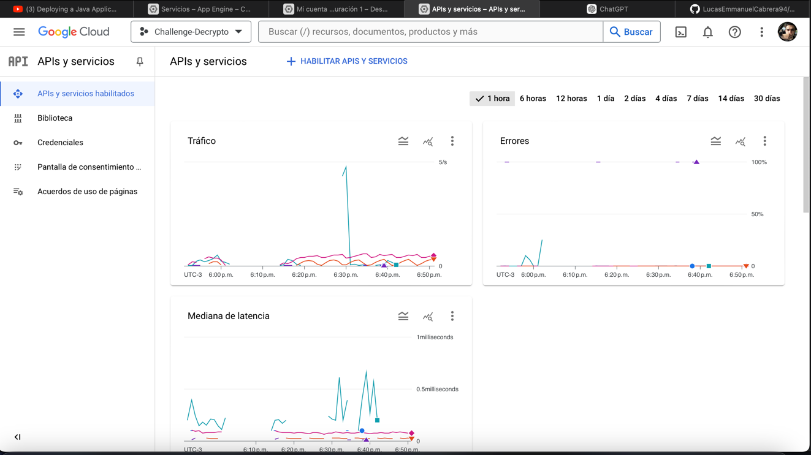

# Desafío Técnico - API REST para Gestión de Comitentes, Mercados y Países

## Objetivo
El principal objetivo de este proyecto es construir una API REST con las operaciones CRUD necesarias para gestionar los recursos Comitente, Mercado y País, y su interrelación.

## Requisitos

### Consignas Principales
1. No puede haber Comitentes repetidos.
2. Un Comitente tiene Id y Descripción.
3. Cada Comitente está relacionado con uno o más Mercados, y un Mercado tiene muchos comitentes.
4. Un Mercado tiene Id, Código, Descripción y País.
5. Los países admitidos son Argentina y Uruguay.
6. Las entidades complementarias deben estar pre-cargadas al momento de usar la API.

### Desafíos Adicionales
#### Nivel 1:
- Desarrollo que cumpla con la consigna inicial.
- Repositorio alojado en GitHub, GitLab, Bitbucket, etc.
- README con la descripción a alto nivel del proyecto y el detalle de configuración para ejecutar el desarrollo localmente.

#### Nivel 2:
- Generar un endpoint con documentación en formato OpenAPI/Swagger.
- Agregar el recurso `/stats` que devuelva cifras totalizadoras de distribución de comitentes por país y mercado.

#### Nivel 3:
- Publicar la API REST en algún servicio gratuito de cloud computing (Google App Engine, Heroku, Amazon AWS, Azure, etc).
- Asegurar que la API pueda manejar fluctuaciones de tráfico (entre 1 y 1100 requests por segundo).

## Tecnología Utilizada
- **Lenguaje**: Java
- **Frameworks**: Spring Boot, JPA
- **Base de datos**: Iba a hacerlo con MySQL pero lo hice con un h2 para que pueda crearse al iniciarse.

## Pasos para compilacion:
1. Clonar el repositorio:
https://github.com/LucasEmmanuelCabrera94/challenge-decrypto.git

2. Despues Runnear la clase "DecryptoApplication"

3. Podes acceder a la base de datos h2:
http://localhost:8080/h2-console

4. Podes acceder al Swagger:
http://localhost:8080/swagger-ui/index.html#/

## Detalles Técnicos y Decisiones de Diseño
Se desarrollaron las operaciones CRUD para las entidades principales: Comitentes, Mercados y Países. Sin embargo, para la entidad País, se decidió no implementar las operaciones de eliminar y editar debido a que los países permitidos son solo Argentina y Uruguay. Esta decisión se tomó porque al eliminar uno de estos países se borrarían todos los comitentes y mercados asociados a ese país, lo que afectaría significativamente la consistencia de los datos y las estadísticas proporcionadas por el endpoint /stats.

Para asegurar la consistencia de los datos iniciales, se creó una configuración de "LoadDatabase" que pre-carga algunos comitentes, mercados y países al inicio. Esto garantiza que siempre haya datos relevantes para probar y utilizar la API sin necesidad de configuraciones adicionales.

## Implementación del Endpoint /stats
El endpoint /stats no muestra los datos en porcentajes. En su lugar, se decidió mostrar la cantidad de comitentes en cada mercado dentro de cada país. Esta decisión permite una visión más clara y directa de la distribución de los comitentes.

## Desafío Personal

El nivel 3 de este proyecto representa un desafío significativo para mí, ya que no tengo experiencia previa en manejar despliegues en servicios de cloud computing ni en asegurar el rendimiento bajo altas cargas de tráfico. Sin embargo, estoy comprometido a aprender y superar este desafío, ya que es una oportunidad valiosa para mejorar mis habilidades y enfrentar nuevos retos.

## Sobre el desafio personal

Después de investigar y realizar ajustes, logré subir el código a Google Cloud y realizar el despliegue con éxito:

Sin embargo, al acceder al Appspot, me encontré con un error 502. Continué investigando para resolver este problema, pero no logré encontrar una solución definitiva. Es evidente que puede haber detalles que se me hayan pasado por alto al no estar familiarizado con este proceso.

